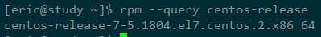
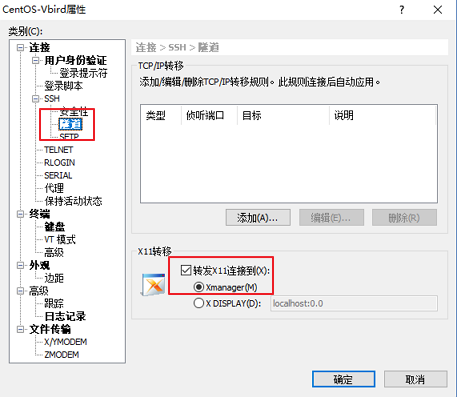

# 第1第2章-环境搭建

参看[这里](https://github.com/yifengyou/The-design-and-implementation-of-a-64-bit-operating-system/blob/master/docs/%E7%AC%AC2%E7%AB%A0-%E7%8E%AF%E5%A2%83%E6%90%AD%E5%BB%BA%E5%8F%8A%E5%9F%BA%E7%A1%80%E7%9F%A5%E8%AF%86/%E7%AC%AC2%E7%AB%A0-%E7%8E%AF%E5%A2%83%E6%90%AD%E5%BB%BA%E5%8F%8A%E5%9F%BA%E7%A1%80%E7%9F%A5%E8%AF%86.md)

不过我用的CentOS-7

## 1. 开发环境配置

一些便捷设置：

1. windows下设置一个和Linux的共享目录LinuxShareFolder。Windows下使用此目录编写程序。Linux下使用此目录编译程序。
2. Linux下执行 `sudo mount -t vboxsf LinuxShareFolder /media/sf_LinuxShareFolder/` 加载共享目录。
3. 共享目录下新建docs写文档，新建code写代码
4. Linux下设置`alias cdsf='/media/sf_LinuxShareFolder'`  # .bashrc中设置，使用cdsf直接跳转到共享目录

Linux下环境信息：

1. 程序目录：/media/sf_LinuxShareFolder/MyOS_MINE/code
2. Bochs目录：/home/eric/Software/bochs-2.6.8

## 2. 虚拟机安装CentOS，编译环境配置

- 使用VirtualBox作为虚拟机，安装CentOS7。网络配置和其它一些配置参看[安装CentOS7](https://coding.net/u/iravinota/p/md-notes/git/blob/master/CentOS7%E5%AE%89%E8%A3%85%E5%90%AF%E5%8A%A8.md)
- 在windows下使用XShell连接虚拟机中的CentOS7进行操作
- XShell配置 属性-->连接-->SSH-->隧道-->转发X11连接到，选择Xmanager。安装好XManager之后，启动Xmanager，**在一个新XShell页面中**，运行bochs，可以打开图形终端。这样，就可以在Windows下直接运行Linux下的Bochs

- 如果没有XManager，则需要直接在虚拟机中启动Bochs，它需要图形界面