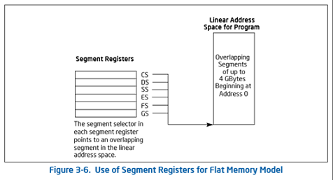

# 第3章-BootLoader引导启动程序

有一些书上讲的不是很明白的地方，需要补充一下。

## 1. 计算机加电启动过程

参考资料：<http://www.brokenthorn.com/Resources/OSDevIndex.html>

1. 按电脑的电源键
2. 产生一个电信号，此电信号传送到主板，告知主板启动电脑
3. 主板把这个电信号告知电源（PSU, Power SUpply），要启动电脑
4. 电源开始给主板以及所有周边设备供电
5. 等电压稳定后，电源产生一个电信号，告知主板，电源供应稳定
6. 主板开始执行POST(Power On Self Test)，检测硬件是否都正常
7. CPU到0xFFF0地址执行第一条BIOS指令。32位计算机的地址空间为0x00000000 - 0xffffffff，对于RAM和ROM(存放着BIOS)，可以被CPU映射到这个地址空间的任意位置。一般情况下，RAM被映射到0x00000000开始的位置，而ROM则被映射到以0xffffffff结束的位置。CPU每次被reset时，都会固定到0xfffffff0处去执行指令，这也就是BIOS所在的位置（不是BIOS的起始位置，是BIOS中一条指令的位置）。CPU启动时，处于16位real mode，可用的地址线只有20位，是无法寻址到0xfffffff0这个位置的。但是为了向下兼容，现在的CPU很可能做了一些特殊处理，比如把高12位地址线全部置为1。这样，ip=0x0000fff0时，其实寻址的位置就是0xfffffff0。使用Bochs模拟的结果如下：


8. BIOS在内存中创建IVT（Interrupt Vector Table），用于执行中断。当CPU芯片上有中断信号到达时，在CPU完成当前指令之后，就会根据IVT执行对应的中断处理程序。IVT被放置在物理内存的最开始位置，从0x0000到0x03ff，一共1024字节，共256项，每项占4个字节，指向IR(Interrupt Routine)所在的地址。
9. BIOS做一些更多的硬件检测，看看硬件是否都正常。
10. BIOS按照设置的设备启动顺序，依次检测这些设备是不是可启动设备。如果一个设备（磁盘、软盘、U盘、光盘等）的第一个sector的第511字节是0x55，第512字节是0xAA，那么这个设备就是一个可启动设备。
11. BIOS把可启动设备的bootable sector加载到**0x7c00**地址处。CPU跳转到0x7c00处开始执行启动程序（也就是第3章编写的boot.asm编译之后的程序）。以上5步为BIOS的执行。
12. *开始执行boot.asm程序*
13. 参看 10. boot.asm启动过程总结
14. *boot.asm程序执行结束*，CPU跳转至0x1000:0000物理地址处继续执行loader.bin
15. *持续更新*


## 2. 通用寄存器


## 3. 段寄存器

- Used in Real Mode:



- Used in Protected Mode:


## 4. 内存使用情况


详细情况请参看[Memory Map](https://wiki.osdev.org/Memory_Map_(x86))

## 4. NASM指令参考

参考[这里](https://www.nasm.us/doc/)

- 十六进制数值常量：0x1f2f, 1f2fh. 参看[这里](https://www.nasm.us/doc/nasmdoc3.html#section-3.4.1)

## 5. 创建虚拟软盘

`bximage`执行之后，会在**当前目录**创建一个boot.img文件，Bochs会使用这个文件作为floppya。所以，我们要在Bochs目录（~/Software/bochs-2.6.8）中执行此命令。在Bochs目录下，.bochsrc中，需要有`floppya: image="boot.img", status=inserted`设置。

``` bash
[eric@study /media/sf_LinuxShareFolder/MyOS_MINE/code]$ l
total 4
-rwxrwxrwx. 1 root root 907 Feb 27 00:06 boot.asm
[eric@study /media/sf_LinuxShareFolder/MyOS_MINE/code]$ nasm boot.asm -o boot.bin
[eric@study /media/sf_LinuxShareFolder/MyOS_MINE/code]$ dd if=boot.bin of=/home/eric/Software/bochs-2.6.8/boot.img bs=512 count=1 conv=notrunc
1+0 records in
1+0 records out
512 bytes (512 B) copied, 0.000302191 s, 1.7 MB/s
```

boot.bin写入boot.img虚拟软盘镜像文件后，boot.img已经拥有了FAT12文件系统。加载loader.bin的方法：

``` bash
$ cd /media/
$ sudo mkdir floppya
$ sudo chmod 777 floppya/
$ cd ~/Software/bochs-2.6.8/
$ id eric
uid=1000(eric) gid=1000(eric) groups=1000(eric),10(wheel)
$ sudo mount boot.img /media/floppya/ -t vfat -o loop,umask=0022,gid=1000,uid=1000      # 加载后的设备以eric用户加载，之后才能用cp复制loader.bin进去
$ cp loader.bin /media/floppya/         # 之后，在bochs目录执行bochs命令，启动模拟器
```

使用命令`umount /media/floppya/`卸载软盘

## 6. Bochs设置

- 注释掉 sound, ata0-master
- 启动bochs时可以直接执行`bochs`命令，默认加载.bochsrc配置文件。书中启动的命令不对。

## 7. 书中代码解释 - NASM和汇编指令要点

- `jmp $` 表示无限循环
- `mov byte[bp-2], cl` bp指向data stack，[]表示寻址，[bp-2]就是stack中向下的2个字节处的地址。这条指令把cl的值放到指定的stack位置中
- `mov bl, [BPB_SecPerTrk]` 把变量BPB_SecPerTrk的值存放到bl中
- `BaseOfStack equ 0x7c00` **equ**相当于宏定义，和用dw定义的变量不同。一般不会放到[]中使用
- Label相当于地址，一般以`jmp Label`方式使用
- `SectorNo dw 0` 定义变量，一般会以`[SectorNo]`方式使用
- `RootDirSizeForLoop dw RootDirSectors` 中，`RootDirSectors`是宏定义，所以此语句意义为`RootDirSizeForLoop dw 14`
- `out` 写入IO端口。目的操作数为立即数时，只能是8位宽；如果是DX寄存器，则可以是16位宽
- *持续更新*

## 8. FAT12文件系统

- 参看[An overview of FAT12](http://www.disc.ua.es/~gil/FAT12Description.pdf)
- 参看[FAT12文件系统简介](https://blog.csdn.net/xhyzjiji/article/details/49027013)
- 参看[FAT File Systems](http://www.ntfs.com/fat-systems.htm)


``` math
偏移字节编号 = 簇编号 * 3 / 2
奇偶性 = 簇编号 * 3 % 2 (0=>簇编号为偶数，1=>簇编号为奇数)
偏移字节编号 / BytesPerSector = 扇区偏移值
偏移字节编号 % BytesPerSector = 扇区内字节的偏移值
```

## 9. LBA<==>CHS转换

书中的公式不对，柱面号=Q>>1，磁头号=Q&1。可以参看[这里](https://blog.csdn.net/G_Spider/article/details/6906184)。

书中没有说明的很重要的一点是：**磁盘填充，先填满一个柱面之后，再填下一个柱面**，以及LBA是从0开始的。

``` math
LBA = (C-CS)*HPC*SPT + (H-HS)*SPT + (S-SS)

C, H, S: 当前的CHS值
CS, HS, SS: Cylinder, Head, Sector的起始编号。一般来说，CS=0，HS=0，SS=1
HPC: Heads Per Cylinder，每个柱面磁头数，也就是每个柱面磁道数
SPT: Sectors Per Track，每个磁道扇区数

SPT > (S-SS) 一定成立
HPC > (H-HS) 一定成立

一般来说，CS=0，HS=0，SS=1，因此可以得出
LBA = C*HPC*SPT + H*SPT + (S-1)

以及 HPC > (H-0)，即 HPC > H

因此：
S = LBA%SPT + 1
H = LBA/SPT%HPC
C = LBA/SPT/HPC

软盘中，HPC=2，所以：
C = (LBA/SPT) >> 1
H = (LBA/SPT) & 1
```

## 10. boot.asm启动过程总结

- 由boot.asm编译成的boot.bin是按照FAT12的格式编写的，使用dd命令把它写入到boot.img虚拟软盘后，这个软盘就是一个可启动设备。bochs中又设置了把boot.img虚拟软盘作为加载设备，所以bochs启动时会由BIOS检查这个虚拟软盘，并把这个软盘的第一个sector拷贝到0x7c00物理地址处。
- CPU跳转到0x7c00物理地址处执行。也就是boot.asm的第一条指令 *jmp short Label_Start*
- boot.asm的主要功能是在屏幕输出几个字符串，并且从FAT12格式化的虚拟软盘中把loader.bin文件加载到**0x1000:0x0000**（即0x10000）物理地址处。
- 其搜素过程为：
  - 从软盘根目录区的起始位置读取一个扇区到**0000:8000**内存处
  - 一个扇区最多存储10h个目录项
  - 检测第一个目录项的前11字节和LoaderFileName指定的字符串是否一致。一致则找到，ES:DI指向匹配的目录项(DI此时指向目录项中的"文件属性")；不一致继续查找下一个目录项。
  - 此扇区的所有目录项都检查完后，还没有找到，则继续读取下一个扇区，从第1步开始执行。
  - 根目录区最多有[RootDirSizeForLoop]（即RootDirSectors）个扇区，都读取完之后依旧没有找到，读取失败
- 其加载过程为：
  - 根据读取到的根目录项，从中可以找到第一个FAT项。把这个FAT项对应的簇（即sector）加载到BaseOfLoader:OffsetOfLoader（即**0x1000:0x0000**）处
  - 然后根据FAT项依次查找下一个FAT项。查找过程中加载FAT所在扇区时，也加载到**0000:8000**物理地址处。
  - 依次加载到指定位置，直至FAT项为0xfff，表示文件结束

## 11. loader.asm从实模式进入保护模式以及IA-32e模式并加载kernel.bin过程

- *参考代码/code/ch03/4/loader.asm*
- 通过设置92h端口，开启A20
- 通过设置GDT、cr0的第0位，短暂进入保护模式，设置FS寄存器，使其可以寻址4G地址空间，CPU进入了所谓的Big Real Mode模式。其实还是在实模式。
- 从软盘中搜索并加载kernel.bin。搜索方式和boot.asm中一样。其加载过程为：
  - 对于每一个待读取的sector，首先读取到内存 BaseTmpOfKernelAddr:OffsetTmpOfKernelFile（即**0000:7E00**，即boot.bin之后，参看第4节）处
  - 对于这个sector，按字节把其复制到 BaseOfKernelFile:OffsetOfKernelFile（即**0000:100000**，即1M）处。此处使用了FS段寄存器的超能力，它可以寻址到4G.
  - 然后再读取下一个sector，直至FAT中为0xfff，表示文件结束。
- 直接向地址空间**B800:0000**处写一个G。会显示在屏幕上
- 关闭软盘驱动器
- *此时，在这段代码之后加一个jmp $，然后随便放一个kernel.bin到虚拟软盘上，就可以看到文件被加载。注意cp后需要使用sync同步，否则bochs有可能还看不到*


- 使用[int 15h/AX=E820h](http://www.ctyme.com/intr/rb-1741.htm)中断获取物理内存信息，存放到 0000:MemoryStructBufferAddr（即**0000:7E00**）处（这个地址是刚才kernel.bin的临时转存地址），供kernel.bin后续使用。
- 使用[int 10h/AX=4F00h](http://www.ctyme.com/intr/rb-0273.htm)获取VBE信息（loader.asm#332行），存储在**0000:8000**处
- 对于获取到到VBE信息，其0E偏移量处为一个指向*显示模式*列表的指针。对于每一个显示模式，使用[int 10h/AX=4F01h](http://www.ctyme.com/intr/rb-0274.htm)获取显示模式信息，连续存储在**0000:8200**为起始的位置，每个显示模式的信息为256 bytes。这个显示模式的列表以FFFFh结尾。
- 使用[int 10h/AX=4F02h](http://www.ctyme.com/intr/rb-0275.htm)设置SVGA Video Mode. 这样就能按指定模式调整bochs窗口大小了。
- 使CPU从实模式进入保护模式 (代码中：init IDT GDT goto protect mode)
  - 执行`cli`禁止可屏蔽中断
  - 执行`lgdt`加载Globle Descriptor Table
  - 置`cr0`寄存器第0位为1，进入保护模式。在此语句之后设置断点，段寄存器状态为：

  

  - 使用一个`jmp dword SelectorCode32:GO_TO_TMP_Protect`指令，设置`CS`寄存器为`GDT`中的代码段。在此语句之后设置断点，段寄存器状态为：

  
  - 设置`ds, es, fs, ss`为`GDT`中的数据段。在此语句之后设置断点，段寄存器状态为：

  
  
- ff
