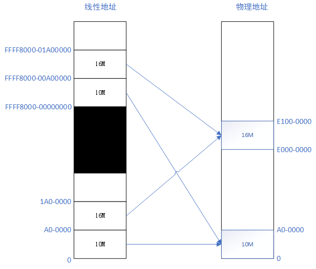
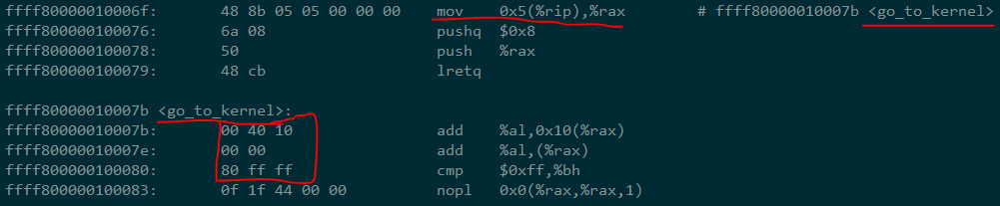
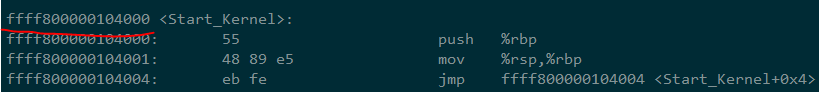
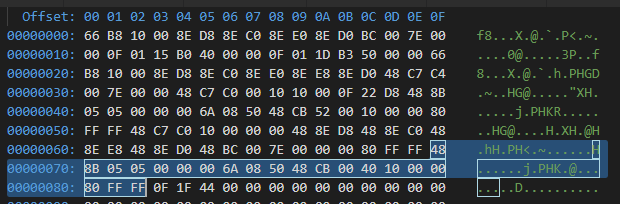
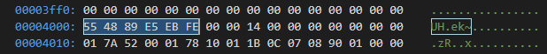
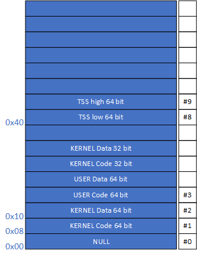
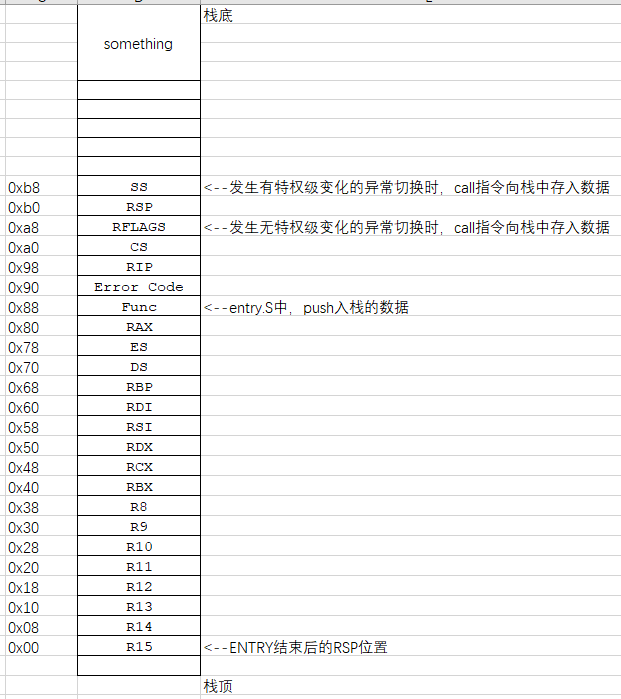

# 第4章-内核层

## 1. 操作

### 1.1 基础环境设置（因个人环境而异）

- 打开VirtualBox，启动CentOS7_Test
- 打开XShell，连接CentOS-Vbird
- `sudo ./mountShareFolder.sh`，加载共享文件夹。

```shell
#!/bin/sh

mount -t vboxsf LinuxShareFolder /media/sf_LinuxShareFolder/
```

- `cdsf`进入/media/sf_LinuxShareFolder目录。.bashrc中设置alias cdcf='cd /media/sf_LinuxShareFolder'
- `sudo mount ~/Software/bochs-2.6.8/boot.img /media/floppya/ -t vfat -o loop,umask=0022,gid=1000,uid=1000` 加载boot.img。由于在ch03中，已经把boot.bin和loader.bin都放到了boot.img中，所以此时能直接在/media/floppya中看到
- 在~/Software/bochs-2.6.8/目录执行`bochs`，打开xmanager图形终端

### 1.2 编译命令

- `gcc -E head.S > head.tmp` : -E只进行预处理，不执行编译、汇编、链接，不会生成目标文件。由于我使用和Windows共享的文件夹，所以在Linux下编译时不能生成head.s，否则就把head.Su覆盖了
- `as --64 -o head.o head.tmp`
- `gcc -mcmodel=large -fno-builtin -m64 -c main.c`
  - -mcmodel 限制程序访问的地址空间，large表明可以访问任何地址空间
  - -fno-builtin 指明，除非使用前缀_builtin_明确引用，编译器不识别所有系统内建函数，如alloca、memcpy等。这个参数就是编译时不识别系统内建函数
  - -c 执行预处理、编译、汇编等过程，但不执行链接过程
- `ld -b elf64-x86-64 -o system head.o main.o -T kernel.lds`
- `objcopy -I elf64-x86-64 -S -R ".eh_frame" -R ".comment" -O binary system kernel.bin`
  - -S 移除所有symbol和relocation信息
  - -R name 从输出文件移除名为name的程序段
  - .en_frame 程序段用于处理异常
  - .comment 程序段用于存放注释信息

## 2. 参考文档

- [Using as](http://sourceware.org/binutils/docs/as/)
- linker script: [Simple Linker Script Example](https://sourceware.org/binutils/docs/ld/Simple-Example.html#Simple-Example), [Linker Scripts](http://www.scoberlin.de/content/media/http/informatik/gcc_docs/ld_3.html), [Linker Scripts - osdev](https://wiki.osdev.org/Linker_Scripts)
- ELF文件格式： [ELF](https://wiki.osdev.org/ELF)。与之对应的是微软的PE文件格式[PE](https://wiki.osdev.org/PE)
- lea: [x86 Assembly Guide](http://flint.cs.yale.edu/cs421/papers/x86-asm/asm.html)

## 3. 书中内容补充

- IA-32e模式下的GDT中的数据段描述符中的L位不起作用，所以对于Data 64-bit Segment，其值为0x00**0**0920000000000
- head.S中地址映射关系



- 使用`ld`命令把head.o和main.o链接起来生成system文件后，使用objdump -D查看这三个文件，可以发现他们遵照Kernel.lds中的设置，把.text设置在ffff800000100000处。main.c中的*Start_Kernel*函数在生成的main.o中就是一个Start_Kernel标签，链接起来后正好和head.S中的*Start_Kernel*匹配上。head.o和main.o中都是使用相对地址。链接成system之后，使用绝对线性地址。
- 程序是如何跳转到Start_Kernel开始执行的呢？我们看`objdump -D system`反编译的程序：





- `mov 0x5(%rip),%rax  # ffff80000010007b <go_to_kernel>` 指令的作用就是把 *go_to_kernel* 标签地址处的值加载到 *%rax* 中，这个值是 *ffff8000-00104000*。通过*lretq*指令，跳转到Start_Kernel处开始执行
- 通过对比kernel.bin和system的反编译结果，可以看出kernel.bin的一开始就是system中.text段的指令。kernel.bin是一个binary文件。而system是一个ELF格式文件。下图中kernel.bin开始处的二进制代码和上面两图的代码完全一致。而且由于kernel.bin被loader.bin加载到0x100000物理地址处，根据前图中线性地址映射关系，它们的地址也是相同的。所以，执行顺序为：**boot.bin-->loader.bin-->kernel.bin(head.o+main.o)**



- kernel.bin前面执行完后，会跳转到*0xffff8000-00104000*地址处执行，物理地址为 *0x104000*，又由于kernel.bin中都是相对地址，kernel.bin被加载到物理地址0x100000处，所以Start_Kernel标签（main.o）所在的位置应该位于*4000*处。如下图所示：



- GDT table



- 异常处理过程：
  - head.S中(Line-35)，使用`lidt`指令把*IDT_Table*的位置加载到*IDTR*寄存器
  - head.S中， *setup_IDE* 程序段初始化*IDE_Table*中所有中断描述符（共256项，每项16B），将*ignore_int*模块作其默认中断处理函数
  - head.S中， *setup_TSS64* 程序段根据 *TSS_Table* 的位置，初始化**GDT**中第8、9两项为TSS描述符（偏移量0x40）
  - head.S中，执行*go_to_kernel*处地址，跳转到main.c中的Start_Kernel执行
  - main.c中，执行load_TR(8)把*TR*寄存器设置为GDT中TSS描述符的偏移量（0x40）
  - main.c中，执行set_tss64()初始化*TSS_Table*
  - main.c中，执行sys_vector_init()初始化中断向量表 **IDT**。由于链接时，entry.o中的所有以*ENTRY()*修饰的变量都是全局描述符，可以被其它程序访问到。entry.o中需要访问的函数在trap.c中，也可以在链接时正确链接。例如， main.c#sys_vector_init() --> trap.c#set_trap_gate(0,1,divide_error) --> entry.S#ENTRY(divide_error) --> trap.c#do_divide_error。
  - sys_vector_init()初始化中断向量表时，对**IDT**中的指定项的中断描述符指定了专门的处理函数入口地址。例如**IDT**中#0号异常指定了*entry.S#ENTRY(divide_error)*进行处理。这样，对应编号的中断或异常产生时，就会执行特定的程序。

- 异常处理时的栈



## 4. GAS syntax

- `.fill repeat, size, value`, size is Byte

## 5. 备注

- 抓住重点