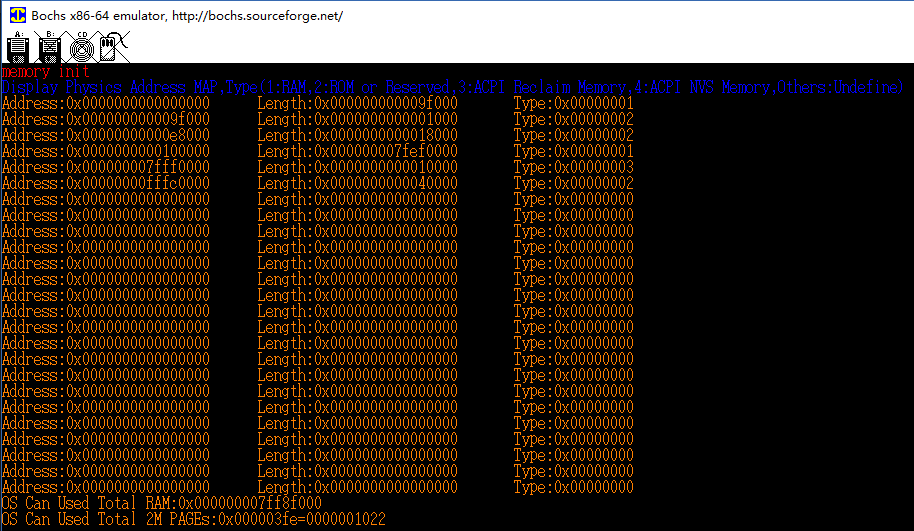
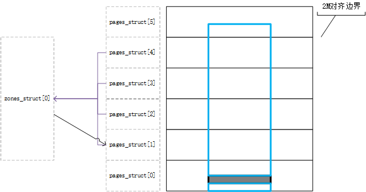
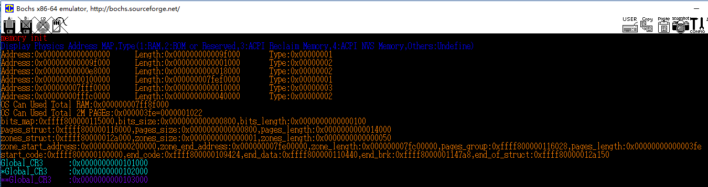

# 第4章-内核层

## 1. 操作

### 1.1 基础环境设置（因个人环境而异）

- 打开VirtualBox，启动CentOS7_Test
- 打开XShell，连接CentOS-Vbird
- `sudo ./mountShareFolder.sh`，加载共享文件夹。

```shell
#!/bin/sh

mount -t vboxsf LinuxShareFolder /media/sf_LinuxShareFolder/
```

- `cdsf`进入/media/sf_LinuxShareFolder目录。.bashrc中设置alias cdcf='cd /media/sf_LinuxShareFolder'
- `sudo mount ~/Software/bochs-2.6.8/boot.img /media/floppya/ -t vfat -o loop,umask=0022,gid=1000,uid=1000` 加载boot.img。由于在ch03中，已经把boot.bin和loader.bin都放到了boot.img中，所以此时能直接在/media/floppya中看到
- 在~/Software/bochs-2.6.8/目录执行`bochs`，打开xmanager图形终端

### 1.2 编译命令

- `gcc -E head.S > head.tmp` : -E只进行预处理，不执行编译、汇编、链接，不会生成目标文件。由于我使用和Windows共享的文件夹，所以在Linux下编译时不能生成head.s，否则就把head.Su覆盖了
- `as --64 -o head.o head.tmp`
- `gcc -mcmodel=large -fno-builtin -m64 -c main.c`
  - -mcmodel 限制程序访问的地址空间，large表明可以访问任何地址空间
  - -fno-builtin 指明，除非使用前缀_builtin_明确引用，编译器不识别所有系统内建函数，如alloca、memcpy等。这个参数就是编译时不识别系统内建函数
  - -c 执行预处理、编译、汇编等过程，但不执行链接过程
- `ld -b elf64-x86-64 -o system head.o main.o -T kernel.lds`
- `objcopy -I elf64-x86-64 -S -R ".eh_frame" -R ".comment" -O binary system kernel.bin`
  - -S 移除所有symbol和relocation信息
  - -R name 从输出文件移除名为name的程序段
  - .en_frame 程序段用于处理异常
  - .comment 程序段用于存放注释信息

## 2. 参考文档

- [Using as](http://sourceware.org/binutils/docs/as/)
- linker script: [Simple Linker Script Example](https://sourceware.org/binutils/docs/ld/Simple-Example.html#Simple-Example), [Linker Scripts](http://www.scoberlin.de/content/media/http/informatik/gcc_docs/ld_3.html), [Linker Scripts - osdev](https://wiki.osdev.org/Linker_Scripts)
- ELF文件格式： [ELF](https://wiki.osdev.org/ELF)。与之对应的是微软的PE文件格式[PE](https://wiki.osdev.org/PE)
- lea: [x86 Assembly Guide](http://flint.cs.yale.edu/cs421/papers/x86-asm/asm.html)

## 3. 书中内容补充

- IA-32e模式下的GDT中的数据段描述符中的L位不起作用，所以对于Data 64-bit Segment，其值为0x00**0**0920000000000
- head.S中地址映射关系：cr3中存放__PML4E的地址(0x101000)，第一级页表


- 使用`ld`命令把head.o和main.o链接起来生成system文件后，使用objdump -D查看这三个文件，可以发现他们遵照Kernel.lds中的设置，把.text设置在ffff800000100000处。main.c中的*Start_Kernel*函数在生成的main.o中就是一个Start_Kernel标签，链接起来后正好和head.S中的*Start_Kernel*匹配上。head.o和main.o中都是使用相对地址。链接成system之后，使用绝对线性地址。
- 程序是如何跳转到Start_Kernel开始执行的呢？我们看`objdump -D system`反编译的程序：


- `mov 0x5(%rip),%rax  # ffff80000010007b <go_to_kernel>` 指令的作用就是把 *go_to_kernel* 标签地址处的值加载到 *%rax* 中，这个值是 *ffff8000-00104000*。通过*lretq*指令，跳转到Start_Kernel处开始执行
- 通过对比kernel.bin和system的反编译结果，可以看出kernel.bin的一开始就是system中.text段的指令。kernel.bin是一个binary文件。而system是一个ELF格式文件。下图中kernel.bin开始处的二进制代码和上面两图的代码完全一致。而且由于kernel.bin被loader.bin加载到0x100000物理地址处，根据前图中线性地址映射关系，它们的地址也是相同的。所以，执行顺序为：**boot.bin-->loader.bin-->kernel.bin(head.o+main.o)**


- kernel.bin前面执行完后，会跳转到*0xffff8000-00104000*地址处执行，物理地址为 *0x104000*，又由于kernel.bin中都是相对地址，kernel.bin被加载到物理地址0x100000处，所以Start_Kernel标签（main.o）所在的位置应该位于*4000*处。如下图所示：


- GDT table


- 异常处理过程：
  - head.S中(Line-35)，使用`lidt`指令把*IDT_Table*的位置加载到*IDTR*寄存器
  - head.S中， *setup_IDE* 程序段初始化*IDE_Table*中所有中断描述符（共256项，每项16B），将*ignore_int*模块作其默认中断处理函数
  - head.S中， *setup_TSS64* 程序段根据 *TSS_Table* 的位置，初始化**GDT**中第8、9两项为TSS描述符（偏移量0x40）
  - head.S中，执行*go_to_kernel*处地址，跳转到main.c中的Start_Kernel执行
  - main.c中，执行load_TR(8)把*TR*寄存器设置为GDT中TSS描述符的偏移量（0x40）
  - main.c中，执行set_tss64()初始化*TSS_Table*
  - main.c中，执行sys_vector_init()初始化中断向量表 **IDT**。由于链接时，entry.o中的所有以*ENTRY()*修饰的变量都是全局描述符，可以被其它程序访问到。entry.o中需要访问的函数在trap.c中，也可以在链接时正确链接。例如， main.c#sys_vector_init() --> trap.c#set_trap_gate(0,1,divide_error) --> entry.S#ENTRY(divide_error) --> trap.c#do_divide_error。
  - sys_vector_init()初始化中断向量表时，对**IDT**中的指定项的中断描述符指定了专门的处理函数入口地址。例如**IDT**中#0号异常指定了 *entry.S#ENTRY(divide_error)* 进行处理。这样，对应编号的中断或异常产生时，就会执行特定的程序。

- 异常处理时的栈


- 物理内存只有在2M边界中的才可用。如果一个连续可用物理内存区域小于2M，则其不可用；如果其只跨越一个2M边界，则其不可用；如果跨越多个2M边界，则2M边界内的可用。

## 4. GAS syntax

- `.fill repeat, size, value`, size is Byte

## 5. 备注

- 抓住重点

## 6. 内存管理

- *loader.asm*使用*int 15h/AX=E820h*中断获取物理内存信息，存放到物理地址**0000:7E00**处
- *head.S*中，设置*cr3*寄存器的值等于**0x101000**，并把 *__PML4E级页表* 放在此物理地址处，设置了线性地址和物理地址的映射关系（参看[第3节中的图](#3-书中内容补充)）
- *memory.c*中，使用 **init_memory()** 函数初始化内存相关数据结构
  - 把线性地址**0xffff800000007e00**（即物理地址*0x7E00*）处的物理内存信息使用*struct E820*进行解析，解析结果放到 *struct Global_Memory_Descriptor memory_management_struct.e820[]* 中。物理地址从0x00开始

  

  - 既然内存的物理信息已经得到，就需要对可用的物理内存进行管理。全部物理内存大小为`TotalMem` Bytes，这里面包含RAM、ROM、以及保留内存：灰色部分表示不可用的内存，所有内存按2M进行分割

  

  - 使用4个数据结构对其进行管理。TotalMem一共可以分割成`TotalMem>>PAGES_2M_SHIFT`个页。`bits_map`使用每一个bit管理一个2M页；`pages_struct`使用每一个*struct Page*管理一个2M页，`zones_struct`使用每个*struct Zone*管理一个连续的可用物理内存区域（2M对齐）（上图中，最下面的那个可用物理内存区域由于大小小于2M，所以也是无法被zones_struct管理起来的。最上面那个也只有2M区域能够完全充满的地方才会被视作可用物理区域）。还有一个*main.c*中的`Global_Memory_Descriptor`管理所有上述三个结构：

  

  - 初始化时，物理内存总共可以分割成多少个2M页，bits_map中就有多少个bit，pages_struct中就有多少个struct Page。而zones_struct中只有连续可用物理区域，例如前前图中的最上面那个物理内存区域
  - 由于一个`zone`中可能有多个`page`，所以`zone结构`中有指向和本zone相关的起始`page结构`的指针。同时，每个`page结构`中，也有指向其所在`zone结构`的指针
  - 使`cr3`指向的__PML4E第一级页表的前10项都置为0，表示前10G都清空，重新加载cr3使新的页表映射关系生效。页表重新生效前的结果：

  

  - 注意，按照这种方式进行内存管理是本书的方式。也可以直接使用一个bits_map结构管理，目的就是知道哪些内存可用，哪些不可用。
  - 弄这么多结构来管理内存的目的就是为了后续使用`alloc_pages`函数从内存中申请可用的页（内存）

## 7. 中断处理

- 这里指的处理硬件中断，编号从0x20开始
- 中断处理的要点就是要设置好**IDT**中对应的项，为其设置中断处理程序。执行中断处理程序时，先保存现场，然后入栈返回地址，最后用jmp跳转到中断处理程序执行。中断处理程序执行完毕后，恢复现场
- 以此设置8295A芯片的 *ICWs* 和 *OCWs*

## 8. 进程初始化和切换

- 内核中的每个进程，都有一个`union task_union`结构体放在内存中的某个位置，用以记录此进程的进程信息（`struct task_struct`）和栈（*stack*），总共32-kb
- *head.S* 部分的程序是从地址0x100000处开始执行的`kernel.bin`的最开始部分，在进入64位模式时，设置栈顶为`_start_stack`处的值，其值为`init_task_union + 32-KB`，而`init_task_union`是在 *task.h* 中定义的结构体
- *head.S* 中定义好`rsp`之后，以后所有的操作都在这个32-kb栈中进行，此时的kernel.bin就已经像是一个进程了（**0号进程**）
- *main.c* 中执行`task_init()`，来初始化 **0号进程** 和 **1号进程init**
  - *task.h* 中，首先定义一些全局数据，并做一些初始化：

  ```bash
  init_task_union -- task -- init_mm
                          -- init_thread
                  -- stack
  init_task[NR_CPUS]
  init_tss[NR_CPUS]
  current = 当前进程的task_struct *
  ```

  - 初始化`init_mm`，设置 **0号进程** 的内存信息
  - 现在假设 **1号进程** 已经初始化完毕，有了自己的32-kb栈和进程信息。需要 **0号进程** 执行`switch_to(prev, next)`，进行进程切换，其中prev是0号进程，next是1号进程。结果是当前CPU的rsp, rip, fs, gs值存入prev->thread对应变量中，加载next->thread的对应值到rsp, rip, fs, gs中，并开始执行next->thread->rip处的指令。这样，栈（rsp）和指令（rip）都切换到了next进程，开始执行next进程。详细过程如下：
    - 把rbp, rax入栈（执行switch_to函数的进程的栈，一般为prev）
    - 把当前rsp、1f(%%rip)的值都存入prev->thread对应变量中（若切换回prev进程执行，则执行`1:`处的指令，即从栈中弹出rax, rbp）
    - 把next->thread->rsp的值放入`rsp`中
    - 把next->thread->rip的值入栈
    - 执行`jmp __switch_to`指令，跳转到 *task.c* 中执行，使用RDI(=prev)和RSI(=next)传递参数
    - 设置tss
    - 把当前fs, gs的值都存入prev->thread对应变量中
    - 把next->thread对应值存入fs, gs中
    - 执行`ret`指令，从栈中弹出next->thread->rip的值，CPU跳转至next->thread->rip处执行