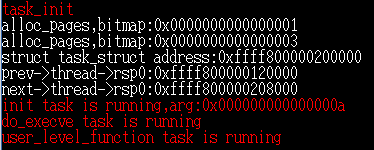
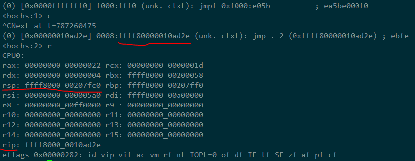
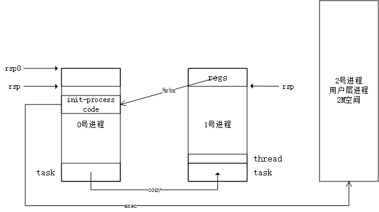
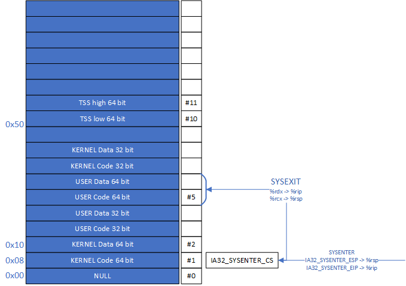

# 第5章-应用层

## 1. 跳转到应用层

- *loader.asm* 把内核程序 *kernel.bin* 加载到 **0x100000** 地址处，进入IA-32e 64位模式，开始执行 *kernen.bin*
- *head.S* 中设置进程PCB(Process Control Block)和栈： `rsp` 的值为 *init_task_union + 32768* ，其中 *init_task_union* 是在 *task.h* 中设置的进程信息结构 *union task_union* 的起始位置
- *main.c* 中执行 *task_init()* 函数，完善进程信息，并开始进行进程切换
- 申请一个内存页（2M），复制正在执行的进程的 *struct task_struct* 信息到页起始位置；伪造一个 *regs* 执行现场（各个寄存器值），存入内存页顶部。内存页顶部作为新进程的栈。*regs* 中 *rbx* 为新进程执行入口， *rdx* 为参数。
- 在新进程的内存页 *struct task_struct* 结构之上再申请一个 *struct thread_struct* 结构，设置其 *rip* 值为 **kernel_thread_func** （若为应用层进程，则为 *ret_system_call*）
- 执行 *switch_to()* ，开始进行进程切换，执行新进程 *struct thread_struct* 结构 *rip* 值指定位置的代码，即 **kernel_thread_func**
- *kernel_thread_func* 恢复伪造的执行现场，最后会执行 *rbx* 所指向的代码，即新进程的代码（这里是 *init* 函数，经测试，其地址大概在 **ffff80000010ad2e** 处，也就是在0号进程代码空间中）
- *init* 函数再次把 `rsp` 寄存器指向新进程内存页栈顶处的伪造 *regs* 结构中，把 *user_level_function* 的用户代码拷贝到 *0x800000* 地址处，设置 *regs* 的 *rdx* 值为 0x800000，设置 *rcx* 值为*0xa00000* ，最后执行 **ret_system_call**
- *entry.S* 中的 **ret_system_call** 恢复执行现场，并执行`sysexit`指令，**从0级进入3级**，开始执行 *0x800000* 地址处程序（拷贝过去的 *user_level_function* ），栈顶为 *0xa00000*

有几点需要注意的地方：

- *init()* 函数的可执行代码在 *kernel.bin* 中，也就是 *0号进程* 的地址范围内。但由于执行 *init()* 函数时，`rsp` 寄存器的值还是位于新内存页，所以 *current* 操作获得的还是新内存页的结构。这可以通过在 *init()* 函数中设置 *while(1);* 断点，来查看其值：

- 0号进程从地址0x00开始， 新地址页从地址0x200000开始。所以上图说明，init函数执行期间，操作的还是新内存页的结构
- 在 0x800000 地址处开始执行时，又分配了一个新栈，栈顶是 **0xa00000**

## 2. 应用层调用系统API

### 2.1 应用层程序调用系统API

- 在这里， *task.c* 中的 *user_level_function()* 中要调用系统API
- *task.c* 中，在task_init()中使用wrmsr()设置`sysenter`执行需要的参数: `IA32_SYSENTER_CS`为 *KERNEL_CS* ，`IA32_SYSENTER_ESP`为 *current->thread->rsp0* 即0号进程的栈底，`IA32_SYSENTER_EIP`为 *system_call* （位于entry.S中）
- *user_level_function()* 设置`%rdx <== xxx(%rip)`和`%rcx <== %rsp`寄存器，供API调用返回时指令`sysexit`使用；设置`%rax`寄存器保存系统调用API向量号。然后执行`sysenter`指令，`%rip`寄存器设置为`IA32_SYSENTER_EIP`寄存器的值，跳转到 *system_call* （位于entry.S中）开始执行
- 执行现场入栈（0号进程的栈），注意`%rdx`寄存器和`%rcx`寄存器也入栈了。然后执行 *system_call_function()* （位于task.c中），同时传入一个参数，指向刚才入栈的执行现场数据结构
- 从 *system_call_table* 结构（位于task.h）中，获取API向量号对应的执行程序进行执行。这样就完成了系统API的调用。

### 2.2 系统API执行完毕后，是怎么返回的

- *task.h* 中 *system_call_table* 对应的API程序执行完毕后，会返回到 *task.c* 中的 *system_call_function()* ，随之又返回到 *entry.S* 中的 *ENTRY(system_call)* 结尾，即 *ENTRY(ret_system_call)* 处，开始执行
- 恢复现场前，设置栈中（0号进程的栈，`sysenter`时保存的现场） *rax* 的值为API调用返回值
- 恢复执行现场，同时也恢复了`%rdx`和`%rcx`寄存器，执行`sysexit`指令，返回应用层，恢复了保存的`%rip`和`%rsp`，返回到 *user_level_function()* 处执行
- *user_level_function()* 把API调用返回值放到 *ret* 变量中，打印出来

### 2.3 更新的GDT

