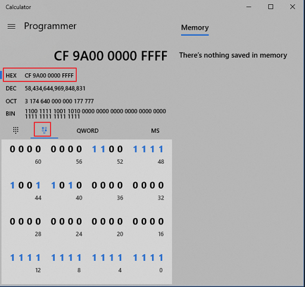

# 第六章-处理器体系结构

## 1. 书上一些讲的不太透彻的点

- 32位保护模式时，逻辑地址由selector:offset两部分组成。例如*jmp selector:offset*指令。其中**selector为16bit**，**offset为32bit**。
- 执行这个跳转指令时，*cs*被设置为**selector>>3<<3**，*cs*的隐藏部分加载GDT中对应的descriptor，便于后续寻址。其中**decriptor为64bit**
- 无论程序还是数据，都必须用segment descriptor加以修饰
- 使用windows自带计算器可以很方便看各个位数。比如loader.asm中`LABEL_DESC_CODE32 dd 0x0000FFFF,0x00CF9A00`，计算器中就输入`00CF9A000000FFFF`，就可以看其各个位

- 

## 2. 参考资料

- [Linux Kernel: Memory Addressing](https://medium.com/hungys-blog/linux-kernel-memory-addressing-a0d304283af3)