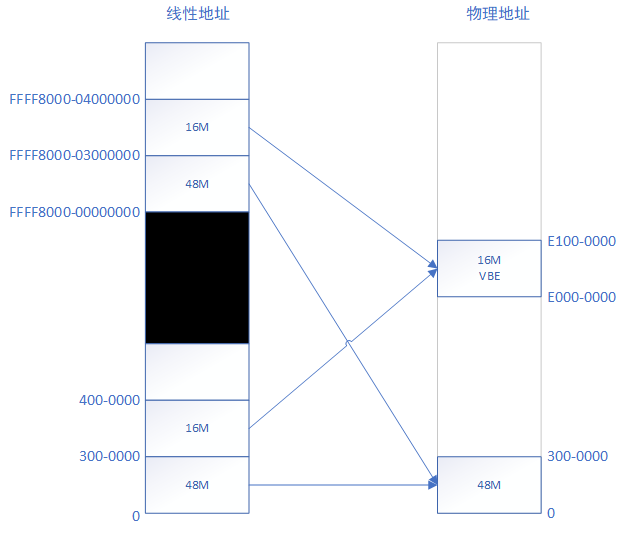
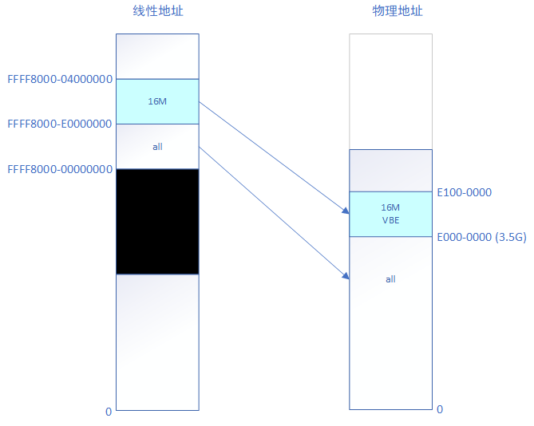

# 第九章-高级内存管理单元

## 1. 一些内容补充

- head.S中设置的新的内存映射（线性地址 --> 物理地址）

- main.c中，init_memory()之后，线性地址0处的地址映射就被重置了，只剩下0xffff8000_00000000处的线性地址映射，线性地址0处的映射被清空
- main.c中的frame_buffer_init()把VBE帧缓冲区的物理地址地址重新映射到线性地址0xffff8000_e0000000处
- main.c中的pagetable_init()把所有物理zones都映射到0xffff8000_00000000的地址处。由于前面VBE地址已经映射过了，所以这里就不再重新映射了

